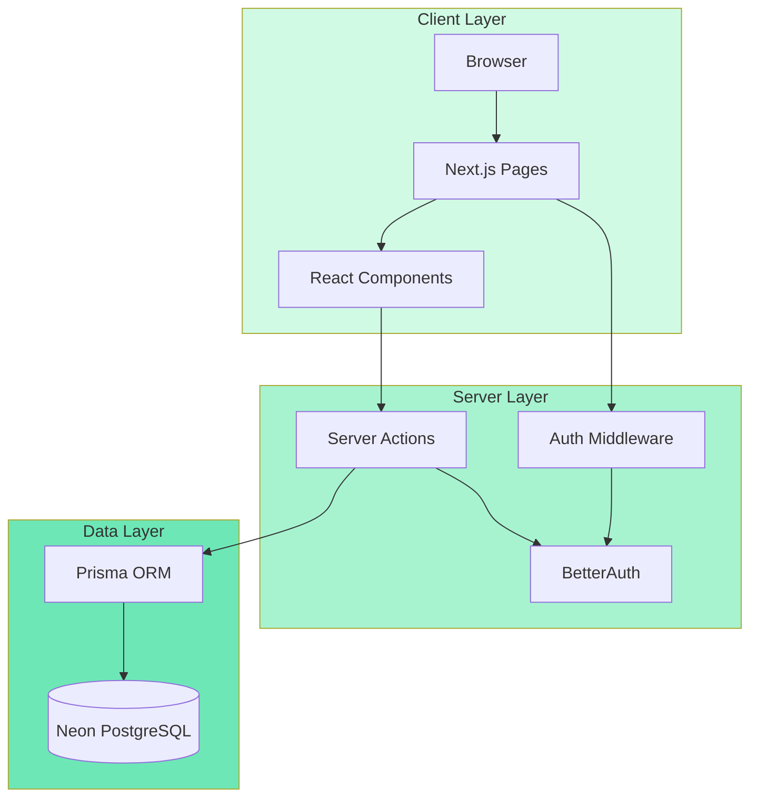
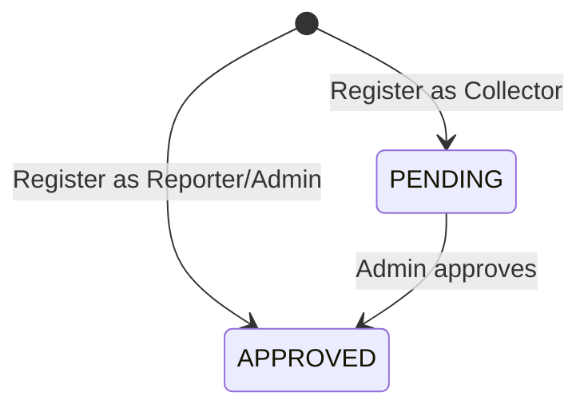
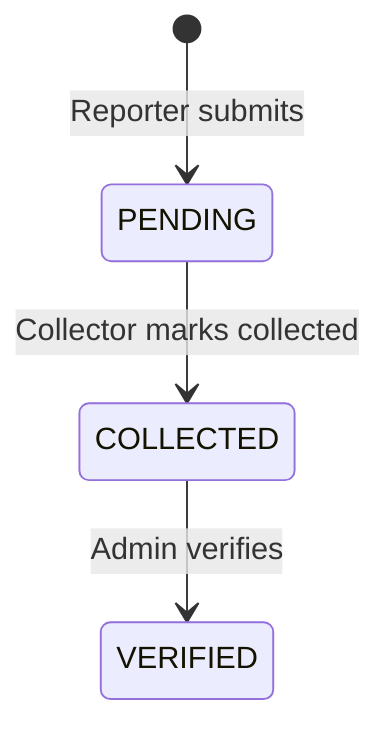

# Technical Design Document

## Overview

The AI Agentic Waste Management Web App is a full-stack Next.js 14 application implementing a role-based waste reporting and collection system. The architecture follows a modern server-side rendering approach with App Router, leveraging React Server Components for optimal performance and BetterAuth for session management.

### Core Architecture Principles

1. **Role-Based Access Control (RBAC)**: Three distinct user roles (Reporter, Collector, Admin) with middleware-enforced route protection
2. **Server-First Data Mutations**: All state-changing operations execute via Next.js Server Actions with built-in authorization
3. **Optimistic UI Updates**: Client components provide immediate feedback while server actions process in the background
4. **Type-Safe Database Layer**: Prisma ORM ensures compile-time type safety between application code and PostgreSQL schema
5. **Component-Driven UI**: Shadcn UI provides a consistent, accessible component library with emerald brand theming

### Technology Stack

- **Frontend**: Next.js 14 (App Router), React 18, TypeScript, Tailwind CSS, Shadcn UI
- **Backend**: Next.js Server Actions, BetterAuth (session management)
- **Database**: Neon PostgreSQL (serverless), Prisma ORM
- **Deployment**: Vercel (recommended) or any Node.js hosting platform

---

## Architecture

### System Architecture Diagram



### Request Flow

1. **Authentication Flow**:
   - User submits credentials → BetterAuth validates → Session created with role/status
   - Middleware reads session → Enforces route access based on role/status
   - Server Actions read session → Enforce operation authorization

2. **Data Mutation Flow**:
   - Client component triggers Server Action → Server Action validates session
   - Authorization check (role + status) → Database transaction via Prisma
   - Success/error response → Client updates UI optimistically or shows error

3. **Page Rendering Flow**:
   - Server Component fetches data via Prisma → Renders with data
   - Client Components hydrate → Interactive elements ready
   - Middleware protects routes → Redirects unauthorized access

### Directory Structure

```
app/
├── (auth)/
│   ├── login/
│   │   └── page.tsx          # Login page
│   └── register/
│       └── page.tsx          # Registration page
├── dashboard/
│   ├── reporter/
│   │   ├── report/
│   │   │   └── page.tsx      # Submit waste reports
│   │   ├── leaderboard/
│   │   │   └── page.tsx      # Reporter leaderboard view
│   │   └── profile/
│   │       └── page.tsx      # Reporter profile
│   └── collector/
│       ├── collect/
│       │   └── page.tsx      # Collect waste reports
│       ├── leaderboard/
│       │   └── page.tsx      # Collector leaderboard view
│       └── profile/
│           └── page.tsx      # Collector profile
├── admin/
│   ├── users/
│   │   └── page.tsx          # Manage pending collectors
│   └── verify/
│       └── page.tsx          # Verify collected reports
├── pending-approval/
│   └── page.tsx              # Waiting for approval page
├── page.tsx                  # Landing page with gallery
├── layout.tsx                # Root layout
└── middleware.ts             # Route protection middleware

components/
├── ui/                       # Shadcn UI components
├── sidebar.tsx               # Global navigation sidebar
├── waste-gallery.tsx         # Waste classification gallery
├── report-form.tsx           # Waste report submission form
├── report-card.tsx           # Waste report display card
└── leaderboard-table.tsx     # Leaderboard display table

lib/
├── auth.ts                   # BetterAuth configuration
├── prisma.ts                 # Prisma client singleton
├── actions/
│   ├── submit-report.ts      # submitReport server action
│   ├── collect-waste.ts      # collectWaste server action
│   ├── update-collector.ts   # updateCollectorStatus server action
│   └── verify-collection.ts  # verifyCollection server action
└── utils.ts                  # Utility functions

prisma/
├── schema.prisma             # Database schema
└── migrations/               # Migration history
```

---

## Components and Interfaces

### Database Models (Prisma Schema)

```prisma
enum Role {
  REPORTER
  COLLECTOR
  ADMIN
}

enum UserStatus {
  PENDING
  APPROVED
}

enum WasteType {
  ORGANIC
  PLASTIC
  METAL
  E_WASTE
  HAZARDOUS
}

enum ReportStatus {
  PENDING
  COLLECTED
  VERIFIED
}

model User {
  id              String        @id @default(cuid())
  email           String        @unique @db.VarChar(255)
  name            String        @db.VarChar(100)
  password        String        // Hashed by BetterAuth
  role            Role
  status          UserStatus    @default(APPROVED)
  points          Int           @default(0)
  
  reportedWaste   WasteReport[] @relation("ReporterReports")
  collectedWaste  WasteReport[] @relation("CollectorReports")
  
  createdAt       DateTime      @default(now())
  updatedAt       DateTime      @updatedAt
  
  @@index([role, status])
  @@index([points])
}

model WasteReport {
  id          String        @id @default(cuid())
  location    String        @db.VarChar(500)
  wasteType   WasteType
  amount      String        @db.VarChar(100)
  status      ReportStatus  @default(PENDING)
  
  reporterId  String
  reporter    User          @relation("ReporterReports", fields: [reporterId], references: [id], onDelete: Cascade)
  
  collectorId String?
  collector   User?         @relation("CollectorReports", fields: [collectorId], references: [id])
  
  feedback    Feedback?
  
  createdAt   DateTime      @default(now())
  updatedAt   DateTime      @updatedAt
  
  @@index([status])
  @@index([reporterId])
  @@index([collectorId])
}

model Feedback {
  id        String      @id @default(cuid())
  reportId  String      @unique
  report    WasteReport @relation(fields: [reportId], references: [id], onDelete: Cascade)
  content   String      @db.VarChar(500)
  createdAt DateTime    @default(now())
}
```

### Server Actions Interface

#### submitReport

```typescript
// lib/actions/submit-report.ts
export async function submitReport(data: {
  location: string;
  wasteType: WasteType;
  amount: string;
}): Promise<{ success: boolean; error?: string; reportId?: string }> {
  // 1. Validate session (must be REPORTER role)
  // 2. Validate input fields
  // 3. Execute transaction:
  //    - Create WasteReport with status PENDING
  //    - Increment reporter's points by 10
  // 4. Return success or error
}
```

#### collectWaste

```typescript
// lib/actions/collect-waste.ts
export async function collectWaste(data: {
  reportId: string;
  feedbackContent: string;
}): Promise<{ success: boolean; error?: string }> {
  // 1. Validate session (must be COLLECTOR role with APPROVED status)
  // 2. Validate feedback content (1-500 chars)
  // 3. Execute transaction:
  //    - Update WasteReport status to COLLECTED
  //    - Set collectorId to current user
  //    - Create Feedback record
  // 4. Return success or error
}
```

#### updateCollectorStatus

```typescript
// lib/actions/update-collector.ts
export async function updateCollectorStatus(data: {
  userId: string;
}): Promise<{ success: boolean; error?: string }> {
  // 1. Validate session (must be ADMIN role)
  // 2. Update User status to APPROVED
  // 3. Return success or error
}
```

#### verifyCollection

```typescript
// lib/actions/verify-collection.ts
export async function verifyCollection(data: {
  reportId: string;
}): Promise<{ success: boolean; error?: string }> {
  // 1. Validate session (must be ADMIN role)
  // 2. Verify report status is COLLECTED (not already VERIFIED)
  // 3. Execute transaction:
  //    - Update WasteReport status to VERIFIED
  //    - Increment collector's points by 20
  // 4. Return success or error
}
```

### Middleware Interface

```typescript
// middleware.ts
export async function middleware(request: NextRequest) {
  // 1. Read session from BetterAuth
  // 2. Extract user role and status
  // 3. Apply route protection rules:
  //    - /dashboard/reporter/* → REPORTER only
  //    - /dashboard/collector/* → COLLECTOR with APPROVED status
  //    - /admin/* → ADMIN only
  //    - Pending collectors → redirect to /pending-approval
  // 4. Redirect unauthorized access to appropriate dashboard or login
}
```

### Component Interfaces

#### Sidebar Component

```typescript
// components/sidebar.tsx
interface SidebarProps {
  user: {
    name: string;
    role: Role;
  };
}

export function Sidebar({ user }: SidebarProps) {
  // Renders role-specific navigation links
  // Displays user name and role
  // Provides logout action
}
```

#### WasteGallery Component

```typescript
// components/waste-gallery.tsx
interface WasteTypeCard {
  type: WasteType;
  name: string;
  description: string; // Min 20 characters
}

export function WasteGallery() {
  // Renders 5 cards (one per waste type)
  // Uses Shadcn Card component
  // Applies emerald brand color
}
```

#### ReportForm Component

```typescript
// components/report-form.tsx
interface ReportFormProps {
  onSubmit: (data: {
    location: string;
    wasteType: WasteType;
    amount: string;
  }) => Promise<void>;
}

export function ReportForm({ onSubmit }: ReportFormProps) {
  // Renders form with location, wasteType, amount fields
  // Validates required fields
  // Calls onSubmit with form data
  // Shows success/error feedback
}
```

#### ReportCard Component

```typescript
// components/report-card.tsx
interface ReportCardProps {
  report: {
    id: string;
    location: string;
    wasteType: WasteType;
    amount: string;
    status: ReportStatus;
    createdAt: Date;
    reporter?: { name: string };
    collector?: { name: string };
    feedback?: { content: string };
  };
  actions?: React.ReactNode; // Optional action buttons
}

export function ReportCard({ report, actions }: ReportCardProps) {
  // Renders report details in Shadcn Card
  // Shows status badge
  // Renders optional action buttons
}
```

#### LeaderboardTable Component

```typescript
// components/leaderboard-table.tsx
interface LeaderboardEntry {
  rank: number;
  userId: string;
  name: string;
  role: Role;
  points: number;
  isCurrentUser: boolean;
}

interface LeaderboardTableProps {
  entries: LeaderboardEntry[];
  currentUserEntry?: LeaderboardEntry; // If outside top 50
}

export function LeaderboardTable({ entries, currentUserEntry }: LeaderboardTableProps) {
  // Renders top 50 users in table
  // Highlights current user's entry
  // Shows current user separately if outside top 50
}
```

---

## Data Models

### User Model

**Purpose**: Represents all system users across three roles (Reporter, Collector, Admin)

**Fields**:
- `id`: Unique identifier (CUID)
- `email`: Unique email address (max 255 chars)
- `name`: User's display name (max 100 chars, non-empty)
- `password`: Hashed password (managed by BetterAuth)
- `role`: Enum (REPORTER, COLLECTOR, ADMIN)
- `status`: Enum (PENDING, APPROVED) - defaults to APPROVED for Reporter/Admin, PENDING for Collector
- `points`: Integer (0-999999) - rewards for participation
- `createdAt`: Timestamp of account creation
- `updatedAt`: Timestamp of last update

**Relations**:
- `reportedWaste`: One-to-many with WasteReport (as reporter)
- `collectedWaste`: One-to-many with WasteReport (as collector)

**Constraints**:
- Email must be unique
- Name must be non-empty
- Points must be between 0 and 999999
- Deleting a User cascades to delete their reported WasteReports

**Indexes**:
- `(role, status)`: For filtering pending collectors
- `(points)`: For leaderboard queries

### WasteReport Model

**Purpose**: Represents a waste report submitted by a Reporter

**Fields**:
- `id`: Unique identifier (CUID)
- `location`: Description of waste location (max 500 chars, non-empty)
- `wasteType`: Enum (ORGANIC, PLASTIC, METAL, E_WASTE, HAZARDOUS)
- `amount`: Description of waste quantity (max 100 chars, non-empty)
- `status`: Enum (PENDING, COLLECTED, VERIFIED) - defaults to PENDING
- `reporterId`: Foreign key to User (reporter)
- `collectorId`: Foreign key to User (collector, nullable)
- `createdAt`: Timestamp of report creation
- `updatedAt`: Timestamp of last update

**Relations**:
- `reporter`: Many-to-one with User (reporterId)
- `collector`: Many-to-one with User (collectorId, optional)
- `feedback`: One-to-one with Feedback (optional)

**Constraints**:
- reporterId must reference existing User
- collectorId must reference existing User (when set)
- Deleting reporter cascades to delete WasteReport
- Deleting collector sets collectorId to null (or prevents deletion)

**Indexes**:
- `(status)`: For filtering pending/collected reports
- `(reporterId)`: For user's report history
- `(collectorId)`: For collector's collection history

### Feedback Model

**Purpose**: Stores collector's feedback when marking a report as collected

**Fields**:
- `id`: Unique identifier (CUID)
- `reportId`: Foreign key to WasteReport (unique)
- `content`: Feedback text (1-500 chars, non-empty)
- `createdAt`: Timestamp of feedback creation

**Relations**:
- `report`: One-to-one with WasteReport

**Constraints**:
- reportId must be unique (one feedback per report)
- reportId must reference existing WasteReport
- Deleting WasteReport cascades to delete Feedback
- Content must be 1-500 characters

### State Transitions

#### User Status Transitions



#### WasteReport Status Transitions



### Points System

| Action | Role | Points Awarded | Timing |
|--------|------|----------------|--------|
| Submit waste report | Reporter | +10 | Immediately on submission |
| Collect waste report | Collector | +20 | When Admin verifies collection |

---

## Correctness Properties

*A property is a characteristic or behavior that should hold true across all valid executions of a system—essentially, a formal statement about what the system should do. Properties serve as the bridge between human-readable specifications and machine-verifiable correctness guarantees.*

### Applicability Assessment

This application is primarily a CRUD web application with significant UI rendering, authentication/authorization, and database infrastructure concerns. Most requirements involve:
- UI component rendering and styling
- Route protection and redirects
- Database schema definitions and constraints
- External service integration (BetterAuth, Neon PostgreSQL)

However, there are specific areas where property-based testing provides value:
- **Input validation logic**: Testing validation across many invalid input combinations
- **Transaction integrity**: Verifying atomic operations (create + update points) work correctly
- **Ordering and sorting logic**: Ensuring lists are correctly ordered across various data sets
- **Authorization enforcement**: Verifying access control works across all server actions

The following properties focus on these testable behaviors in our application code, while UI rendering, infrastructure setup, and external service integration will be covered by example-based and integration tests.

### Property 1: Registration Input Validation Rejects Invalid Data

*For any* registration submission with invalid data (malformed email, empty name, password shorter than 8 characters, or invalid role enum value), the system SHALL reject the registration and return a validation error without creating a User record.

**Validates: Requirements 2.2**

### Property 2: Waste Report Submission Transaction Integrity

*For any* valid waste report data (non-empty location, valid wasteType enum, non-empty amount) submitted by an authenticated Reporter, the system SHALL atomically create a WasteReport record with status PENDING and increment the Reporter's points by exactly 10, such that both operations succeed together or both fail together.

**Validates: Requirements 6.2**

### Property 3: Waste Report Validation Rejects Invalid Data

*For any* waste report submission with invalid data (empty location, invalid wasteType enum value, or empty amount), the system SHALL reject the submission and display validation errors without creating a WasteReport record.

**Validates: Requirements 6.3**

### Property 4: Reporter's Report List Ordering

*For any* Reporter with multiple WasteReports, when the Reporter views their report list, the system SHALL display all reports ordered by createdAt in descending order (most recent first).

**Validates: Requirements 6.4**

### Property 5: Collection Transaction Integrity

*For any* valid feedback content (1-500 characters) submitted by an authenticated approved Collector for a PENDING WasteReport, the system SHALL atomically update the report status to COLLECTED, set the collectorId to the Collector's id, and create a Feedback record, such that all three operations succeed together or all fail together.

**Validates: Requirements 7.4**

### Property 6: Collector Approval Status Transition

*For any* User with role COLLECTOR and status PENDING, when an Admin invokes the updateCollectorStatus action, the system SHALL update the User's status to APPROVED.

**Validates: Requirements 8.2**

### Property 7: Collection Verification Transaction Integrity

*For any* WasteReport with status COLLECTED, when an Admin invokes the verifyCollection action, the system SHALL atomically update the report status to VERIFIED and increment the associated Collector's points by exactly 20, such that both operations succeed together or both fail together.

**Validates: Requirements 9.2**

### Property 8: Leaderboard Ordering and Limiting

*For any* set of Users with assigned points values, when the leaderboard is rendered, the system SHALL display users ordered by points in descending order (highest first) and limit the display to at most 50 users.

**Validates: Requirements 10.3**

### Property 9: Server Action Authorization Enforcement

*For any* server action (submitReport, collectWaste, updateCollectorStatus, verifyCollection), when invoked without a valid authenticated session OR with a session where the User's role does not match the required role for that action, the system SHALL return an authentication or authorization error without modifying any database records.

**Validates: Requirements 13.5, 13.6**

---

## Error Handling

### Error Categories

1. **Validation Errors**: Client-side and server-side validation failures
   - Invalid email format, empty required fields, enum value mismatches
   - Response: Display user-friendly error messages near relevant form fields
   - HTTP Status: 400 Bad Request

2. **Authentication Errors**: Missing or invalid session
   - Unauthenticated access to protected routes or server actions
   - Response: Redirect to `/login` page (routes) or return error (server actions)
   - HTTP Status: 401 Unauthorized

3. **Authorization Errors**: Valid session but insufficient permissions
   - Wrong role attempting to access route or invoke server action
   - Pending collector attempting to access collector dashboard
   - Response: Redirect to appropriate dashboard or return error
   - HTTP Status: 403 Forbidden

4. **Database Errors**: Prisma query failures, constraint violations
   - Unique constraint violation (duplicate email)
   - Foreign key constraint violation
   - Connection errors
   - Response: Display generic error message to user, log detailed error server-side
   - HTTP Status: 500 Internal Server Error

5. **Transaction Errors**: Atomic operation failures
   - Partial failure in multi-step operations (e.g., create report + increment points)
   - Response: Rollback transaction, display error message, ensure no partial state
   - HTTP Status: 500 Internal Server Error

### Error Handling Patterns

#### Server Actions Error Pattern

```typescript
export async function serverAction(data: InputType): Promise<Result> {
  try {
    // 1. Validate session
    const session = await auth.getSession();
    if (!session) {
      return { success: false, error: "Authentication required" };
    }
    
    // 2. Validate authorization
    if (session.user.role !== REQUIRED_ROLE) {
      return { success: false, error: "Insufficient permissions" };
    }
    
    // 3. Validate input
    const validation = validateInput(data);
    if (!validation.success) {
      return { success: false, error: validation.error };
    }
    
    // 4. Execute database transaction
    const result = await prisma.$transaction(async (tx) => {
      // Atomic operations here
      return result;
    });
    
    return { success: true, data: result };
    
  } catch (error) {
    // Log error server-side
    console.error("Server action error:", error);
    
    // Return generic error to client
    return { success: false, error: "An unexpected error occurred" };
  }
}
```

#### Middleware Error Pattern

```typescript
export async function middleware(request: NextRequest) {
  try {
    const session = await auth.getSession();
    
    // Unauthenticated access to protected routes
    if (!session && isProtectedRoute(request.nextUrl.pathname)) {
      return NextResponse.redirect(new URL("/login", request.url));
    }
    
    // Role-based route protection
    if (session) {
      const redirectUrl = getRedirectForRole(session.user.role, session.user.status, request.nextUrl.pathname);
      if (redirectUrl) {
        return NextResponse.redirect(new URL(redirectUrl, request.url));
      }
    }
    
    return NextResponse.next();
    
  } catch (error) {
    // Log error and redirect to safe page
    console.error("Middleware error:", error);
    return NextResponse.redirect(new URL("/login", request.url));
  }
}
```

#### Client Component Error Pattern

```typescript
"use client";

export function FormComponent() {
  const [error, setError] = useState<string | null>(null);
  const [isLoading, setIsLoading] = useState(false);
  
  async function handleSubmit(data: FormData) {
    try {
      setIsLoading(true);
      setError(null);
      
      const result = await serverAction(data);
      
      if (!result.success) {
        setError(result.error);
        return;
      }
      
      // Success handling
      toast.success("Operation completed successfully");
      
    } catch (error) {
      setError("An unexpected error occurred. Please try again.");
    } finally {
      setIsLoading(false);
    }
  }
  
  return (
    <form onSubmit={handleSubmit}>
      {error && <ErrorAlert message={error} />}
      {/* Form fields */}
    </form>
  );
}
```

### Error Logging and Monitoring

- **Server-side errors**: Log to console (development) or external service (production)
- **Client-side errors**: Use error boundaries to catch React errors
- **Database errors**: Log full error details server-side, show generic message to users
- **Authentication errors**: Log failed login attempts for security monitoring

---

## Testing Strategy

### Testing Approach Overview

This application requires a multi-layered testing strategy that balances comprehensive coverage with practical implementation:

1. **Property-Based Tests**: For core business logic with universal properties (9 properties identified)
2. **Example-Based Unit Tests**: For specific scenarios, edge cases, and UI component behavior
3. **Integration Tests**: For database operations, authentication flows, and external service integration
4. **End-to-End Tests**: For critical user workflows across the full stack

### Property-Based Testing

**Library**: [fast-check](https://github.com/dubzzz/fast-check) (TypeScript/JavaScript)

**Configuration**:
- Minimum 100 iterations per property test
- Each test must reference its design document property via comment tag
- Tag format: `// Feature: ai-waste-management-system, Property {number}: {property_text}`

**Property Test Implementation**:

Each of the 9 correctness properties defined above must be implemented as a property-based test:

1. **Property 1**: Generate random invalid registration data (malformed emails, empty names, short passwords, invalid roles), verify all rejected
2. **Property 2**: Generate random valid report data, verify report created and points incremented by 10 atomically
3. **Property 3**: Generate random invalid report data, verify all rejected with validation errors
4. **Property 4**: Generate random sets of reports with random timestamps, verify ordering by createdAt descending
5. **Property 5**: Generate random valid feedback content, verify transaction updates report, sets collector, creates feedback atomically
6. **Property 6**: Generate random pending collectors, verify status updated to APPROVED
7. **Property 7**: Generate random collected reports, verify transaction updates status and increments points by 20 atomically
8. **Property 8**: Generate random sets of users with random point values, verify ordering by points descending and limit to 50
9. **Property 9**: For each server action, generate requests without session or with wrong role, verify authorization errors

**Example Property Test Structure**:

```typescript
import fc from "fast-check";
import { describe, it, expect } from "vitest";

describe("Waste Report Submission", () => {
  it("Property 2: Waste Report Submission Transaction Integrity", async () => {
    // Feature: ai-waste-management-system, Property 2: For any valid waste report data, system SHALL atomically create WasteReport and increment Reporter points by 10
    
    await fc.assert(
      fc.asyncProperty(
        fc.record({
          location: fc.string({ minLength: 1, maxLength: 500 }),
          wasteType: fc.constantFrom("ORGANIC", "PLASTIC", "METAL", "E_WASTE", "HAZARDOUS"),
          amount: fc.string({ minLength: 1, maxLength: 100 }),
        }),
        async (reportData) => {
          // Setup: Create reporter user
          const reporter = await createTestUser({ role: "REPORTER" });
          const initialPoints = reporter.points;
          
          // Act: Submit report
          const result = await submitReport(reportData, reporter.id);
          
          // Assert: Report created and points incremented atomically
          expect(result.success).toBe(true);
          
          const createdReport = await prisma.wasteReport.findUnique({
            where: { id: result.reportId },
          });
          expect(createdReport).toBeDefined();
          expect(createdReport.status).toBe("PENDING");
          
          const updatedReporter = await prisma.user.findUnique({
            where: { id: reporter.id },
          });
          expect(updatedReporter.points).toBe(initialPoints + 10);
          
          // Cleanup
          await cleanupTestData(reporter.id);
        }
      ),
      { numRuns: 100 }
    );
  });
});
```

### Example-Based Unit Tests

**Purpose**: Test specific scenarios, edge cases, and component behavior

**Coverage Areas**:
- **Authentication flows**: Registration, login, logout with specific valid/invalid credentials
- **Route protection**: Specific role/status combinations accessing specific routes
- **UI component rendering**: Sidebar links, form fields, empty states, error messages
- **Status transitions**: Specific state changes (PENDING → APPROVED, PENDING → COLLECTED → VERIFIED)
- **Edge cases**: Duplicate email registration, verifying already-verified report, empty lists

**Example Unit Test**:

```typescript
describe("User Registration", () => {
  it("should set status to PENDING for new Collector", async () => {
    const result = await registerUser({
      email: "collector@test.com",
      name: "Test Collector",
      password: "password123",
      role: "COLLECTOR",
    });
    
    expect(result.success).toBe(true);
    
    const user = await prisma.user.findUnique({
      where: { email: "collector@test.com" },
    });
    
    expect(user.status).toBe("PENDING");
  });
  
  it("should set status to APPROVED for new Reporter", async () => {
    const result = await registerUser({
      email: "reporter@test.com",
      name: "Test Reporter",
      password: "password123",
      role: "REPORTER",
    });
    
    expect(result.success).toBe(true);
    
    const user = await prisma.user.findUnique({
      where: { email: "reporter@test.com" },
    });
    
    expect(user.status).toBe("APPROVED");
  });
  
  it("should reject duplicate email registration", async () => {
    await registerUser({
      email: "duplicate@test.com",
      name: "User One",
      password: "password123",
      role: "REPORTER",
    });
    
    const result = await registerUser({
      email: "duplicate@test.com",
      name: "User Two",
      password: "password456",
      role: "COLLECTOR",
    });
    
    expect(result.success).toBe(false);
    expect(result.error).toContain("email");
  });
});
```

### Integration Tests

**Purpose**: Test database operations, authentication integration, and cross-layer interactions

**Coverage Areas**:
- **Database constraints**: Unique email constraint, foreign key constraints, cascade deletes
- **BetterAuth integration**: Session creation, validation, invalidation
- **Prisma transactions**: Multi-step atomic operations
- **Middleware + Server Actions**: End-to-end authorization flow

**Example Integration Test**:

```typescript
describe("Collection Verification Integration", () => {
  it("should verify collection and award points in transaction", async () => {
    // Setup: Create reporter, collector, admin, and collected report
    const reporter = await createTestUser({ role: "REPORTER" });
    const collector = await createTestUser({ role: "COLLECTOR", status: "APPROVED" });
    const admin = await createTestUser({ role: "ADMIN" });
    
    const report = await prisma.wasteReport.create({
      data: {
        location: "Test Location",
        wasteType: "PLASTIC",
        amount: "5 bags",
        status: "COLLECTED",
        reporterId: reporter.id,
        collectorId: collector.id,
      },
    });
    
    await prisma.feedback.create({
      data: {
        reportId: report.id,
        content: "Collected successfully",
      },
    });
    
    const initialPoints = collector.points;
    
    // Act: Admin verifies collection
    const result = await verifyCollection({ reportId: report.id }, admin.id);
    
    // Assert: Report verified and collector points incremented
    expect(result.success).toBe(true);
    
    const verifiedReport = await prisma.wasteReport.findUnique({
      where: { id: report.id },
    });
    expect(verifiedReport.status).toBe("VERIFIED");
    
    const updatedCollector = await prisma.user.findUnique({
      where: { id: collector.id },
    });
    expect(updatedCollector.points).toBe(initialPoints + 20);
    
    // Cleanup
    await cleanupTestData(reporter.id, collector.id, admin.id);
  });
});
```

### End-to-End Tests

**Purpose**: Test critical user workflows across the full stack

**Tool**: Playwright or Cypress

**Coverage Areas**:
- **Reporter workflow**: Register → Login → Submit report → View report list → Check leaderboard
- **Collector workflow**: Register → Wait for approval → Login → Collect report → Check leaderboard
- **Admin workflow**: Login → Approve collector → Verify collection

**Example E2E Test**:

```typescript
test("Reporter can submit waste report and see it in their list", async ({ page }) => {
  // Register and login as reporter
  await page.goto("/register");
  await page.fill('input[name="email"]', "reporter@test.com");
  await page.fill('input[name="name"]', "Test Reporter");
  await page.fill('input[name="password"]', "password123");
  await page.selectOption('select[name="role"]', "REPORTER");
  await page.click('button[type="submit"]');
  
  // Navigate to report submission
  await page.goto("/dashboard/reporter/report");
  
  // Submit waste report
  await page.fill('input[name="location"]', "123 Main St");
  await page.selectOption('select[name="wasteType"]', "PLASTIC");
  await page.fill('input[name="amount"]', "3 bags");
  await page.click('button[type="submit"]');
  
  // Verify success message
  await expect(page.locator('text=Report submitted successfully')).toBeVisible();
  
  // Verify report appears in list
  await expect(page.locator('text=123 Main St')).toBeVisible();
  await expect(page.locator('text=PLASTIC')).toBeVisible();
  await expect(page.locator('text=3 bags')).toBeVisible();
  await expect(page.locator('text=PENDING')).toBeVisible();
});
```

### Test Organization

```
tests/
├── unit/
│   ├── actions/
│   │   ├── submit-report.test.ts
│   │   ├── collect-waste.test.ts
│   │   ├── update-collector.test.ts
│   │   └── verify-collection.test.ts
│   ├── components/
│   │   ├── sidebar.test.tsx
│   │   ├── waste-gallery.test.tsx
│   │   ├── report-form.test.tsx
│   │   └── leaderboard-table.test.tsx
│   └── lib/
│       └── validation.test.ts
├── property/
│   ├── registration-validation.property.test.ts
│   ├── report-submission.property.test.ts
│   ├── report-validation.property.test.ts
│   ├── report-ordering.property.test.ts
│   ├── collection-transaction.property.test.ts
│   ├── collector-approval.property.test.ts
│   ├── verification-transaction.property.test.ts
│   ├── leaderboard-ordering.property.test.ts
│   └── authorization.property.test.ts
├── integration/
│   ├── auth-flow.integration.test.ts
│   ├── database-constraints.integration.test.ts
│   ├── middleware-protection.integration.test.ts
│   └── transaction-integrity.integration.test.ts
└── e2e/
    ├── reporter-workflow.e2e.test.ts
    ├── collector-workflow.e2e.test.ts
    └── admin-workflow.e2e.test.ts
```

### Test Data Management

- **Unit/Property Tests**: Use in-memory SQLite database or test database with automatic cleanup
- **Integration Tests**: Use dedicated test database with transaction rollback after each test
- **E2E Tests**: Use seeded test database that resets between test runs

### Coverage Goals

- **Property-based tests**: 100% coverage of 9 identified properties
- **Unit tests**: 80%+ coverage of server actions, components, and utility functions
- **Integration tests**: 100% coverage of critical database transactions and auth flows
- **E2E tests**: 100% coverage of primary user workflows (reporter, collector, admin)

---

